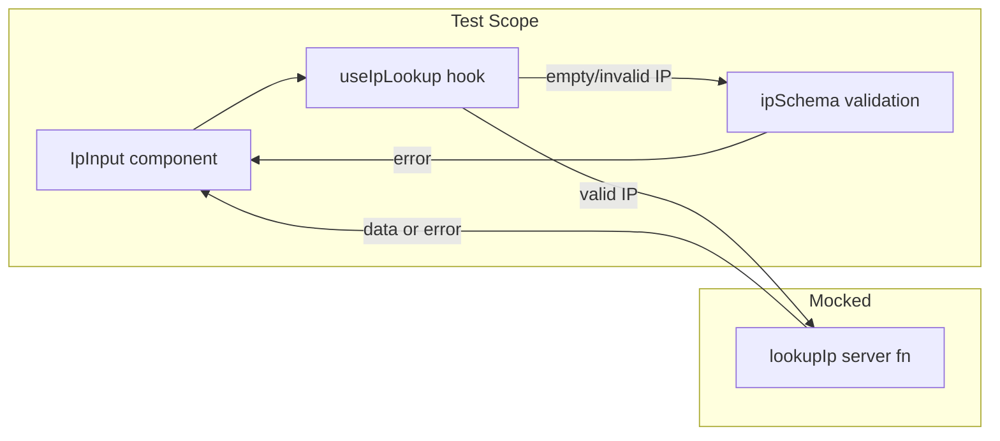

# Component Test Setup and Implementation

## Test directory layout

All test infrastructure and test files live under `src/__tests__/`, mirroring the source tree:

```
src/__tests__/
  setup.ts                              # vitest setup (jest-dom matchers)
  test-utils.tsx                        # renderWithQueryClient helper
  routes/
    AppDriver.tsx                       # Driver for the App component
    index.test.tsx                      # Test 1
  components/
    ip-input/
      IpInputDriver.tsx                 # Driver for IpInput component
      IpInput.test.tsx                  # Tests 2a--2e
```

## Architecture

The key mock boundary is `lookupIp` from [src/server-fns/ip-lookup.ts](src/server-fns/ip-lookup.ts). Client-side Zod validation in [useIpLookup](src/components/ip-input/useIpLookup.ts) runs before the server function is called, so tests 2a/2b exercise real validation while 2c-2e mock the network layer.




---

# Phase 1 -- Setup, installation, AppDriver + Test 1

## Step 1 -- Config and setup

### 1a. tsconfig.json -- no changes needed

The existing [tsconfig.json](tsconfig.json) already includes `"**/*.ts"` and `"**/*.tsx"`, which covers `src/__tests__/`. This means:

- Test files are **type-checked** by the IDE and by `tsc -b` (the build step) -- catching type errors in tests early is a feature.
- Vite only bundles files reachable from the entry point via imports. Since no app code imports from `__tests__/`, test files are **never in the production bundle** regardless of tsconfig include/exclude.

Test files will use explicit imports from `'vitest'` (`describe`, `it`, `expect`, `vi`, etc.) rather than globals, so no vitest types need to be added to tsconfig `compilerOptions.types`.

### 1b. vitest.config.ts -- new file at project root

Separate from `vite.config.ts` to avoid TanStack Start / Netlify plugin interference:

- `environment: 'jsdom'`
- `@` path alias matching [tsconfig.json](tsconfig.json)
- `include: ['src/__tests__/**/*.test.{ts,tsx}']` -- scoped to the test folder
- `setupFiles: ['src/__tests__/setup.ts']`

### 1c. src/**tests**/setup.ts

Imports `@testing-library/jest-dom/vitest` to extend `expect` with DOM matchers (`toBeInTheDocument()`, etc.).

**New dev dependency:** `@testing-library/jest-dom`

## Step 2 -- Test render utility

Create `src/__tests__/test-utils.tsx` exporting a `renderWithQueryClient` wrapper that:

- Creates a fresh `QueryClient` with `retry: false` (so errors surface immediately instead of retrying)
- Wraps the component in `QueryClientProvider`
- Returns the standard Testing Library `render` result

This is needed because [useIpLookup](src/components/ip-input/useIpLookup.ts) calls `useQuery`.

## Step 3 -- Export App for testing

In [src/routes/index.tsx](src/routes/index.tsx), export the `App` function (currently only used internally by `createFileRoute`). Change:

```typescript
function App() {
```

to:

```typescript
export function App() {
```

This enables test 1 to render the real `App` composition without needing the TanStack Router context (`App` doesn't use any router hooks).

## Step 4 -- AppDriver + Test 1

### 4a. AppDriver (`src/__tests__/routes/AppDriver.tsx`)

A lightweight driver class for the `App` component:

```typescript
class AppDriver {
  get = {
    addInputButton: () => screen.getByRole('button', { name: /add input/i }),
    ipInputs: () => screen.queryAllByPlaceholderText('Enter IP address'),
  }

  set = {
    clickAddInput: () => fireEvent.click(this.get.addInputButton()),
    clickAddInputTimes: (n: number) => {
      for (let i = 0; i < n; i++) this.set.clickAddInput()
    },
  }

  render() {
    return renderWithQueryClient(<App />)
  }
}
```

Includes `vi.mock('@/server-fns/ip-lookup', ...)` at module level (imported transitively by `IpInput`).

### 4b. Test file (`src/__tests__/routes/index.test.tsx`)

- **Test 1**: "clicking Add Input X times creates X inputs"

```typescript
const driver = new AppDriver()
driver.render()
driver.set.clickAddInputTimes(3)
expect(driver.get.ipInputs()).toHaveLength(3)
```

### Phase 1 checkpoint

Run `npm test` and verify `src/__tests__/routes/index.test.tsx` passes. This confirms the entire test infrastructure (vitest config, jsdom, path aliases, jest-dom matchers, QueryClient wrapper, and the AppDriver pattern) is working before building on it.

---

# Phase 2 -- IpInputDriver + Tests 2a--2e

## Step 5 -- IpInputDriver + Tests 2a--2e

### 5a. IpInputDriver (`src/__tests__/components/ip-input/IpInputDriver.tsx`)

`IpInputDriver` **composes `AppDriver`** rather than rendering `IpInput` in isolation. Its `render()` method mounts the full `App` via the parent driver and clicks "Add Input" to create a real `IpInput` -- mimicking how a user actually reaches the component.

```typescript
class IpInputDriver {
  private appDriver = new AppDriver()

  get = {
    input: () => screen.getByPlaceholderText('Enter IP address'),
    errorByText: (text: string) => screen.getByText(text),
    queryErrorByText: (text: string) => screen.queryByText(text),
    flagImage: () => screen.queryByRole('img'),
    findFlagImage: () => screen.findByRole('img'),
    time: () => screen.getByText(/\d{2}:\d{2}:\d{2}/),
  }

  set = {
    typeIp: (value: string) => {
      fireEvent.change(this.get.input(), { target: { value } })
    },
    blur: () => {
      fireEvent.blur(this.get.input())
    },
    typeAndBlur: (value: string) => {
      this.set.typeIp(value)
      this.set.blur()
    },
  }

  mocks = {
    lookupSuccess: (data: IpLookupResponse) => {
      vi.mocked(lookupIp).mockResolvedValue(data)
    },
    lookupError: (message: string) => {
      vi.mocked(lookupIp).mockRejectedValue(new Error(message))
    },
    reset: () => {
      vi.mocked(lookupIp).mockReset()
    },
  }

  render() {
    this.appDriver.render()
    this.appDriver.set.clickAddInput()
  }
}
```

The `vi.mock('@/server-fns/ip-lookup', ...)` call lives at the module level in the driver file (hoisted by vitest). `vi.useFakeTimers()` / `vi.useRealTimers()` are managed in the test file's `beforeEach` / `afterEach`.

### 5b. Test file (`src/__tests__/components/ip-input/IpInput.test.tsx`)

Each test creates a fresh driver instance. Using fake timers for the clock interval.

**Test 2a -- Empty input**

```typescript
driver.render()
driver.set.blur()
expect(driver.get.errorByText('IP address is required')).toBeInTheDocument()
expect(lookupIp).not.toHaveBeenCalled()
```

**Test 2b -- Invalid IP**

```typescript
driver.render()
driver.set.typeAndBlur('not-an-ip')
expect(driver.get.errorByText('Invalid IP address format')).toBeInTheDocument()
expect(lookupIp).not.toHaveBeenCalled()
```

**Test 2c -- Valid IPv4**

```typescript
driver.mocks.lookupSuccess({ country_code: 'US', time_zone: '-05:00' })
driver.render()
driver.set.typeAndBlur('8.8.8.8')
expect(await driver.get.findFlagImage()).toHaveAttribute('alt', 'us')
vi.advanceTimersByTime(250)
expect(driver.get.time()).toBeInTheDocument()
```

**Test 2d -- Valid IPv6**

```typescript
driver.mocks.lookupSuccess({ country_code: 'DE', time_zone: '+01:00' })
driver.render()
driver.set.typeAndBlur('2001:4860:4860::8888')
expect(await driver.get.findFlagImage()).toHaveAttribute('alt', 'de')
```

**Test 2e -- API error**

```typescript
driver.mocks.lookupError('Rate limit exceeded')
driver.render()
driver.set.typeAndBlur('8.8.8.8')
expect(await screen.findByText('Rate limit exceeded')).toBeInTheDocument()
expect(driver.get.flagImage()).not.toBeInTheDocument()
```

### Phase 2 checkpoint

Run `npm test` and verify all 6 tests (1 from Phase 1 + 5 from Phase 2) pass.

---

# Phase 3 -- Add tests to pre-push hook

## Step 6 -- Update pre-push git hook

In [package.json](package.json), update the `simple-git-hooks.pre-push` value to run tests alongside the existing type-check:

```jsonc
// before
"pre-push": "npm run tsc"

// after
"pre-push": "npm run tsc && npm test"
```

Then run `npx simple-git-hooks` to re-register the hook.

### Phase 3 checkpoint

Verify the hook is registered by inspecting `.git/hooks/pre-push`, confirming it contains `npm run tsc && npm test`.

---

## Files summary

- **Create** `vitest.config.ts` -- vitest config scoped to `src/__tests__/`
- **Create** `src/__tests__/setup.ts` -- jest-dom matchers
- **Create** `src/__tests__/test-utils.tsx` -- `renderWithQueryClient`
- **Create** `src/__tests__/routes/AppDriver.tsx` -- driver for App component
- **Create** `src/__tests__/routes/index.test.tsx` -- test 1
- **Create** `src/__tests__/components/ip-input/IpInputDriver.tsx` -- driver for IpInput component
- **Create** `src/__tests__/components/ip-input/IpInput.test.tsx` -- tests 2a--2e
- **Modify** [src/routes/index.tsx](src/routes/index.tsx) -- export `App`
- **Modify** [package.json](package.json) -- add `npm test` to `pre-push` hook
- **Install** `@testing-library/jest-dom` (dev dependency)

No changes to [tsconfig.json](tsconfig.json) -- test files are type-checked via the existing `include` and never bundled by Vite.