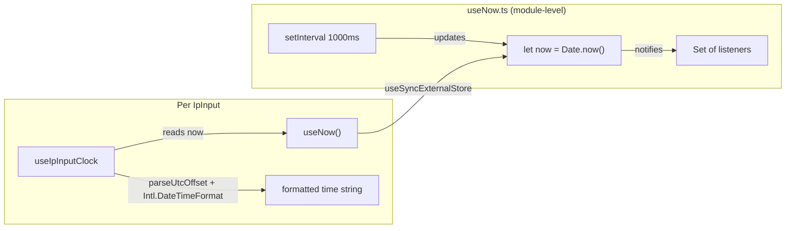

# Global Clock with `useSyncExternalStore`

## Current state

[useIpInputClock.ts](src/components/ip-input/useIpInputClock.ts) runs its own `setInterval(250)` per mounted input. N inputs = N intervals, and inputs sharing a timezone can drift apart by up to 250ms.

## New architecture




One interval total. All components re-render in the same React batch. Zero desync.

## File changes

### 1. Create `src/hooks/useNow.ts`

A new ~15-line module that owns the single global ticker:

```typescript
import { useSyncExternalStore } from 'react'

type Callback = () => void

let now = Date.now()
const listeners = new Set<Callback>()

setInterval(() => {
  now = Date.now()
  listeners.forEach((l) => l())
}, 1000)

function subscribe(cb: Callback) {
  listeners.add(cb)
  return () => listeners.delete(cb)
}

function getSnapshot() {
  return now
}

export function useNow() {
  return useSyncExternalStore(subscribe, getSnapshot, getSnapshot)
}
```

### 2. Simplify `src/components/ip-input/useIpInputClock.ts`

- Remove `useState`, `useRef`, `useEffect`, and the `setInterval` logic entirely.
- Import `useNow` from the new hook.
- Keep `parseUtcOffset` as-is (pure function, unchanged).
- Move the `Intl.DateTimeFormat` to a module-level constant (it has no dynamic dependencies).
- The hook body becomes pure derivation: read `now`, compute offset, format, return.

Roughly:

```typescript
import { useMemo } from 'react'
import { useNow } from '@/hooks/useNow'

const formatter = new Intl.DateTimeFormat('en-US', {
  timeZone: 'UTC',
  timeStyle: 'medium',
  hour12: false,
})

function parseUtcOffset(offset: string): number | null {
  const match = offset.match(/^([+-])(\d{2}):(\d{2})$/)
  if (!match) return null
  const sign = match[1] === '+' ? 1 : -1
  return sign * (parseInt(match[2]) * 60 + parseInt(match[3]))
}

export const useIpInputClock = (props: { utcOffset: string | null }) => {
  const now = useNow()

  const offsetMs = useMemo(() => {
    if (!props.utcOffset) return null
    const minutes = parseUtcOffset(props.utcOffset)
    return minutes != null ? minutes * 60_000 : null
  }, [props.utcOffset])

  if (offsetMs == null) return { time: undefined }
  return { time: formatter.format(new Date(now + offsetMs)) }
}
```

### 3. No changes needed in `IpInput.tsx`

The component already calls `useIpInputClock({ utcOffset: timeZone })` and reads `time`. The interface doesn't change.

### 4. Tests

Existing tests in [IpInput.test.tsx](src/__tests__/components/ip-input/IpInput.test.tsx) use `findTime()` which matches `/\d{2}:\d{2}:\d{2}/`. Since `useNow()` returns a value immediately on first render (the module-level `now` is initialized at import time), the formatted time is available on the first render after lookup data arrives -- no interval tick needed. Tests should continue passing without changes.

Run `npm test` to confirm.

## What this does NOT change

- `parseUtcOffset` logic (still uses UTC offset strings from the API)
- `IpInput.tsx` component code
- `useIpLookup.ts`
- Test files

