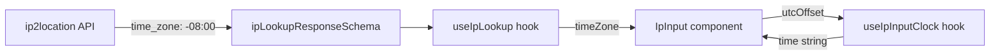

# Integrate Time Zone from IP Lookup into Clock

## Current State

- The IP lookup API (`ip2location.io`) returns `time_zone` as a **UTC offset string** like `"-08:00"`, not an IANA timezone name.
- `[src/schemas/ip.ts](src/schemas/ip.ts)` only captures `country_code` from the response -- `time_zone` is discarded.
- `[src/components/ip-input/useIpLookup.ts](src/components/ip-input/useIpLookup.ts)` only exposes `countryCode`.
- `[src/components/ip-input/useIpInputClock.ts](src/components/ip-input/useIpInputClock.ts)` expects an IANA timezone string (e.g., `'Asia/Jerusalem'`) for `Intl.DateTimeFormat`.
- `[src/components/ip-input/IpInput.tsx](src/components/ip-input/IpInput.tsx)` hardcodes `timeZone: 'Asia/Jerusalem'` instead of using the lookup result.

## Changes

### 1. Add `time_zone` to the response schema

In `[src/schemas/ip.ts](src/schemas/ip.ts)`, add `time_zone` to `ipLookupResponseSchema`:

```typescript
export const ipLookupResponseSchema = z.object({
  country_code: z.string(),
  time_zone: z.string(),
})
```

### 2. Expose `timeZone` from `useIpLookup`

In `[src/components/ip-input/useIpLookup.ts](src/components/ip-input/useIpLookup.ts)`, add `timeZone` to the return object:

```typescript
return {
  lookup,
  clearError,
  countryCode: data?.country_code?.toLowerCase() ?? null,
  timeZone: data?.time_zone ?? null,
  isLoading,
  error,
}
```

### 3. Modify `useIpInputClock` to accept a UTC offset string

In `[src/components/ip-input/useIpInputClock.ts](src/components/ip-input/useIpInputClock.ts)`, change the prop from `timeZone: string` (IANA) to `utcOffset: string | null` (e.g., `"-08:00"`).

Since `Intl.DateTimeFormat` does not accept raw UTC offset strings, the approach is:

- Parse the offset string (e.g., `"-08:00"`) into a total offset in minutes.
- On each tick, get the current UTC time, apply the offset manually, and format using `Intl.DateTimeFormat` with `timeZone: 'UTC'`.

Rough logic:

```typescript
function parseUtcOffset(offset: string): number | null {
  const match = offset.match(/^([+-])(\d{2}):(\d{2})$/);
  if (!match) return null;
  const sign = match[1] === '+' ? 1 : -1;
  return sign * (parseInt(match[2]) * 60 + parseInt(match[3]));
}
```

Then in the effect, instead of passing `timeZone` to the formatter, use `timeZone: 'UTC'` and shift the Date:

```typescript
const offsetMs = offsetMinutes * 60 * 1000;
const shifted = new Date(Date.now() + offsetMs);
// format `shifted` with timeZone: 'UTC'
```

This avoids needing IANA names entirely and correctly displays the time at the given UTC offset (with the DST caveat the user already acknowledged).

### 4. Wire it together in `IpInput.tsx`

In `[src/components/ip-input/IpInput.tsx](src/components/ip-input/IpInput.tsx)`:

- Destructure `timeZone` from `useIpLookup()`.
- Pass it to the clock hook: `useIpInputClock({ utcOffset: timeZone })`.
- Remove the hardcoded `'Asia/Jerusalem'`.

## Data Flow



---

## Note: Alternative Approaches Considered (for reference only, not part of implementation)

We evaluated four approaches for converting the API's UTC offset string (e.g., `"-08:00"`) into a displayable clock time. **Approach A was chosen.**

### Approach A: Manual parse + UTC-shifted Date (chosen)

Parse the offset string into minutes, shift a `Date` by that amount, and format with `Intl.DateTimeFormat` using `timeZone: 'UTC'`.

- **Pros:** Works in every browser/runtime. Handles all offsets including fractional hours (`+05:30`, `+05:45`). No dependencies.
- **Cons:** Creates semantically "fake" Date objects (shifted UTC). Small parser to maintain.

### Approach B: Convert to `Etc/GMT` IANA timezone

Convert `"-08:00"` to `"Etc/GMT+8"` (IANA inverts the sign) and pass to `Intl.DateTimeFormat`.

- **Pros:** Uses `Intl.DateTimeFormat` with a real IANA timezone. No manual date arithmetic. Universally supported.
- **Cons:** `Etc/GMT` zones only support whole-hour offsets -- fractional offsets like `+05:30` (India), `+05:45` (Nepal), `+09:30` (Australia/Darwin) cannot be represented. The inverted sign convention is error-prone.

### Approach C: Pass offset string directly to `Intl.DateTimeFormat`

Modern engines support UTC offset strings (e.g., `"-08:00"`) as valid `timeZone` values natively, as part of the Temporal proposal's influence on the Intl spec.

- **Pros:** Minimal code change -- the existing hook barely needs modification. Handles fractional offsets natively.
- **Cons:** Depends on recent engine support. Harder to unit test since behavior is engine-dependent.
- **Minimum browser requirements:** Chrome 119+, Firefox 120+, Safari 17.2+, Edge 119+. Node.js 21+ (with ICU). No support in IE or older mobile WebViews.

### Approach D: Use a date library (luxon, date-fns-tz, dayjs)

Offload offset handling to a third-party library.

- **Pros:** Battle-tested, handles edge cases.
- **Cons:** Adds a dependency for something achievable in ~10 lines of code. Overkill for a fixed-offset clock tick.


