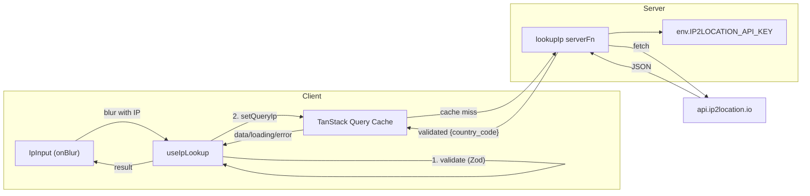

# IP Lookup Integration

## Architecture




## File Changes

### 1. New: `src/schemas/ip.ts` -- Shared Zod schemas (client-safe)

Pure validation schemas with no server imports -- safe for both client and server:

- `ipSchema`: `z.string().min(1, "IP address is required").ip("Invalid IP address format")` -- validates IPv4/IPv6 using Zod's built-in `.ip()` validator
- `ipLookupResponseSchema`: `z.object({ country_code: z.string() })` -- only extracts the field we need

### 2. New: `src/server-fns/ip-lookup.ts` -- Server function (server-only)

This file is only imported server-side, so it can safely import `env`:

- Imports schemas from [src/schemas/ip.ts](src/schemas/ip.ts)
- Imports `env` from [src/env.js](src/env.js)
- `createServerFn({ method: 'GET' })` with `.inputValidator()` calling `ipSchema.parse()` for server-side defense in depth
- Handler fetches `https://api.ip2location.io/?key=${env.IP2LOCATION_API_KEY}&ip=${ip}&format=json`
- Parses the response JSON through `ipLookupResponseSchema` to validate and narrow the return type to `{ country_code: string }`

### 3. New: `src/components/ip-input/useIpLookup.ts` -- Custom hook

Uses `useQuery` with a single `queryIp` state for automatic caching per IP. This is the **only piece of React state** in the entire feature (the input itself is uncontrolled via a ref):

- `**lookup(ip: string)`**: Client-side validation via `ipSchema.safeParse()`. On failure, sets a `validationError` state and clears `queryIp`. On success, sets `queryIp` which triggers the query.
- `**useQuery`**: `queryKey: ['ip-lookup', queryIp]`, `enabled: !!queryIp`, `queryFn` calls the server function.
- **State minimization**: Only two pieces of state -- `queryIp` (drives the query) and `validationError` (for client-side validation failures). No input value state needed.
- **Error clearing**: Hook exposes a `clearError` function that sets `validationError` to `null`. Called on `onChange` so errors only disappear when the user actively modifies the input (not on accidental focus).
- **Returns**: `{ lookup, clearError, countryCode, isLoading, error }` where `error` unifies validation errors and query errors into a single string.

### 4. Update: [src/components/ip-input/IpInput.tsx](src/components/ip-input/IpInput.tsx)

- Use an **uncontrolled input with `useRef`** instead of controlled state -- no `useState` in the component at all
- Call `useIpLookup()` hook
- Wire `onBlur` to call `lookup(inputRef.current.value)`
- Wire `onChange` to call `clearError()` -- clears stale validation errors only when the user actively modifies the input
- Replace hardcoded `countryCode: 'il'` with `countryCode` from the hook
- Conditionally render the flag only when `countryCode` is available
- Show loading indicator during fetch
- Display `error` string to the user (e.g., below the input in red text)

## Security Boundary

```
src/schemas/ip.ts          -- pure Zod, no secrets, safe for client
src/server-fns/ip-lookup.ts -- imports env + API key, server-only
src/components/...          -- only imports from schemas/ and the serverFn RPC stub
```

The client never imports `env.js` or any file that imports it. The API key stays server-side.

## Notes

- Zod 4's `.ip()` validates both IPv4 and IPv6 -- no custom regex needed
- No new dependencies required -- `zod`, `@tanstack/react-query`, and `@tanstack/react-start` are already installed

